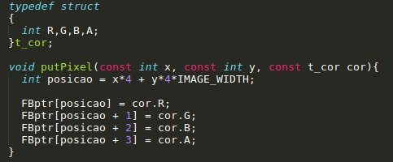
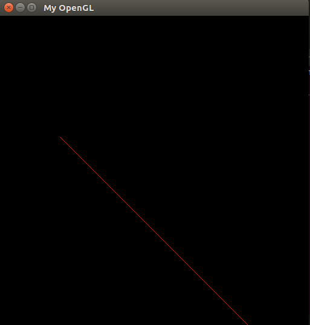
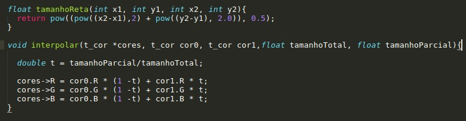
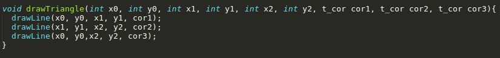
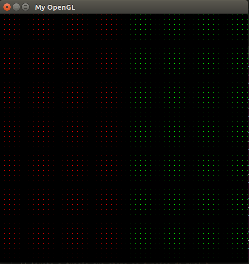
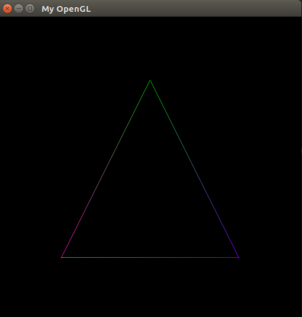

# Menu

* [Atividade 1 - Bresenham](#bresenham)

## Grupo
Alexandre Costa Santa Cruz 2016013344

Nilbson Rafael Oliveira Galindo 2016011869

---

### Objetivo
A primeira atividade da disciplina de Introdução à Computação Gráfica tem como principal objetivo o desenvolvimento e implementação do algorimo de Bresenham para a rasterização de linhas. Este, por sua vez, traz uma forma de solucionar o problema de desenhar uma reta em uma tela pixelada. Para tanto, a tarefa propõe a criação de uma função para pintar um pixel na tela, uma função para desenhar uma reta na tela e uma função para desenhar um triângulo na tela. Por fim, além das 3 funções requisitadas, pede-se também que ocorra a interpolação linear das cores durante a formação das retas e do triângulo.

---

### Desenvolvimento
#### Rasterização de Pontos
Inicialmente, o posicionamento de um pixel na tela é fundamental para o desenvolvimento de qualquer que seja o desenho. Vale ressaltar que o pixel possui sua cor determinada por meio do padrão RGB no momento em que é criado. Nesse sentido, através do conhecimento adquirido nas aulas ministradas pelo professor da disciplina foi possível desenvolver a função requisitada.

	 
	
	<h5 align="center">Figura 1 - Função PutPixel()</h5>
	 

#### Rasterização de Linhas
O algoritmo de Bresenham funciona apenas para desenhar retas no primeiro octante da tela, ou seja, retas entre 0º e 45º. Para que possamos representar retas nos demais octantes é preciso realizar uma generalização do algoritmo.

	 
	
	<h5 align="center">Figura 2 - Limitação do Algoritmo</h5>
	 

#### Generalização do Algoritmo de Bresenham
É sabido que a tela não apresenta cordenadas negativas e como temos a necessidade de representar as retas dos demais octantes, modificaremos o algoritmo de forma que todas as retas consigam ser representadas no primeiro quadrante, mantendo seu sentido e inclinação.

<ul>
	<li>A primeira modificação a ser feita é considerar apenas os valores absolutos das variações dx e dy.</li>
	<li>A segunda modificação a ser feita é expandir o algoritmo para dar suporte à simetria das retas: verifica-se os valores das cordenadas do ponto final (xf,yf) são menores que as cordenadas do ponto inicial(xi,yi)</li>
	<li>A terceira modificação é adicionar ao algoritmo o passo responsável por desenhar retas com ângulo de 90º.</li>
	<li>Na quarta e última modificação, verificamos se o valor da variação da reta no eixo y é maior que a variação da reta no eixo x.</li>
<ul>

#### Interpolação das Cores
A interpolação linear das cores foi solucionada com uma simples lógica matemática em que a posição atual da reta é dividida pelo tamanho total gerando assim números de 0 a 1 chamado no código de "t"  e esse número é multiplicado pela cor final e (1-t) é multiplicado pela cor inicial. Dessa forma, ocorre a transição da cor inicial para a final. 

	 
	
	<h5 align="center">Figura 3 - Função de Interpolação de Cores</h5>
	 

#### Desenhar o Triângulo
A última etapa da tarefa era o desenho de o um triângulo que é só chamar a função de desenhar linha três vezes.

	 
	
	<h5 align="center">Figura 4 -Função de desenhar o Triângulo</h5>
	 

---

### Resultados
Após a compreensão tanto do problema quanto do código ficou mais tranquila a resolução da tarefa. Com o famoso de divisão e conquista, o problema se apresentou em problemas menores e mais fáceis. A maior dificuldade foi entender o algoritmo de Bresenham em si e assim criar várias estruturas condicionas para que a entrada fosse polída e pudesse se encaixar neste algoritmo. Acreditamos que o código poderia se apresentar de forma mais enxuta com menos if visto que qualquer redução de código feita será bem vista.

	 
	
	<h5 align="center">Figura 5 - Pontos</h5>
	 

	 
	
	<h5 align="center">Figura 6 - Retas</h5>
	 

	 
	
	<h5 align="center">Figura 7 - Triangulo</h5>
	 

---

### Referências

http://wesnydyribeiro.blogspot.com/2017/02/rasterizacao-de-pontos-e-linhas.html?m=1

https://en.wikipedia.org/wiki/Rasterisation

---
